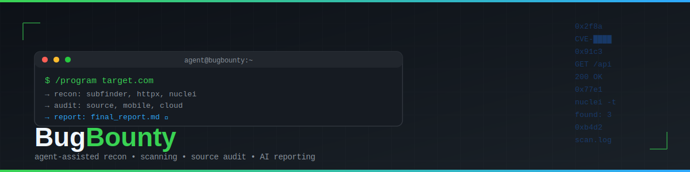
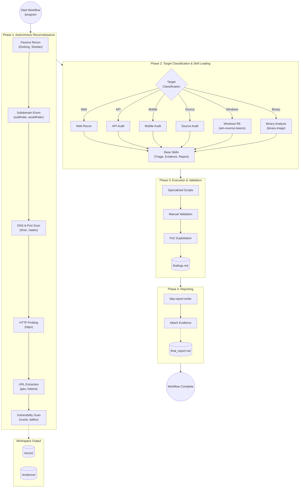

<div align="center">



[](https://github.com/BMNTR/BugBounty/blob/master/LICENSE)
[](https://github.com/BMNTR/BugBounty/search?l=powershell)
[](#prerequisites)
[](#agent-setup-ai-assistant)
[](https://github.com/BMNTR/BugBounty/commits/master/)
[](https://github.com/BMNTR/BugBounty/stargazers)

</div>

---

## Table of Contents

- [Prerequisites](#prerequisites)
- [Quick Setup](#quick-setup)
- [Wordlists](#wordlists)
- [Agent Setup (AI Assistant)](#agent-setup-ai-assistant)
- [Workflow](#workflow)
  - [Pipeline Flowchart](#pipeline-flowchart)
- [Structure](#structure)
- [Private Programs](#private-programs)
- [Disclaimer](#disclaimer)

---

# BugBounty

Bug bounty workflow automation — agent-assisted recon, scanning, source audit, mobile analysis, and report writing.

## Prerequisites

Install these first:

| Tool | Minimum | Check |
|------|---------|-------|
| **Go** | 1.21+ | `go version` |
| **Python** | 3.11+ | `python --version` |
| **Node.js** | 18+ | `node -v` |
| **Rust** | 1.70+ | `rustc --version` |
| **Java JDK** | 17 | `java -version` |
| **Git** | any | `git --version` |

Windows only: install [Go](https://go.dev/dl/), [Python](https://www.python.org/downloads/), [Node](https://nodejs.org/), [Rust](https://rustup.rs/), [Java](https://adoptium.net/), [Git](https://git-scm.com/).

## Quick Setup

Clone and install:

```powershell
git clone https://github.com/BMNTR/BugBounty.git C:\BugBounty
cd C:\BugBounty
# 1. Install Web/Mobile/Cloud tools
scripts\update_all_tools.ps1
# 2. Install Windows/Binary Reverse Engineering tools
scripts\install_windows_tools.ps1
```

This installs:
- **Subdomain**: subfinder, amass, assetfinder
- **URL/Spider**: gau, waybackurls, katana, hakrawler
- **Probe**: httpx, dnsx
- **Fuzz**: ffuf
- **Scan**: nuclei
- **Secrets**: gitleaks, trufflehog
- **SCA**: trivy, grype, osv-scanner, cargo-audit
- **Code**: semgrep, codeql
- **Mobile**: apktool, jadx, frida, objection
- **Windows RE**: sysinternals, x64dbg, ghidra, dnspy
- **Other**: jq, yq, fd, fzf, bat, delta

## Wordlists

```powershell
cd wordlists
git clone https://github.com/danielmiessler/SecLists
git clone https://github.com/swisskyrepo/PayloadsAllTheThings
```

## Agent Setup (AI Assistant)

This repository is designed to act as the "brain" and toolkit for **any Agentic AI assistant**.

You can use the AI CLI or editor of your choice. Simply point your AI assistant to this repository folder:

```powershell
cd C:\BugBounty
# Launch your preferred AI CLI here
# Or open this folder in your AI-powered code editor
```

As long as the AI assistant is opened inside `C:\BugBounty`, it will automatically read `AGENTS.md` and `SKILL.md` to inherit the full Bug Bounty workflow instructions.

## Workflow

```
/program <program-url> [name]
```

This triggers:
1. Recon (subs → alive → URLs → nuclei)
2. Skill loading (web/API/mobile/source/cloud)
3. Deep testing based on findings
4. Report generation

### Pipeline Flowchart



## Structure

```
C:\BugBounty\
├── scripts\           # workflow automation scripts
├── .agents\skills\    # security audit skills & skill packs
├── _templates\        # report templates
├── programs\          # per-target workspace
│   └── <slug>\
│       ├── recon\     # raw recon output (gitignored)
│       ├── evidence\  # PoCs, screenshots (gitignored)
│       └── state.json
├── tools\             # binaries (gitignored, auto-installed)
├── wordlists\         # SecLists, PayloadsAllTheThings (gitignored)
├── recon\             # global recon (gitignored)
├── AGENTS.md          # agent workflow rules
├── SKILL.md           # command encyclopedia
└── README.md
```

## Private Programs

Login to your target platform (HackerOne, YesWeHack, Bugcrowd, etc.) in your browser, then:

```powershell
scripts\setup-cookies.ps1
```

Saves `cookies.txt` (gitignored). The agent auto-detects and uses it.

## Disclaimer

**Educational and Authorized Auditing Purposes Only**

This project and all associated scripts, workflows, and tools are provided solely for educational purposes and for authorized security testing (such as formal Bug Bounty programs or authorized penetration testing). 

The use of these tools against any system, network, or application without explicit permission from the owner is illegal and strictly prohibited. 

The creator (BMNTR) and contributors of this repository bear no responsibility for any misuse, unauthorized access, or damage caused by the application of these tools. By using this repository, you agree that you are solely responsible for your actions and that you will comply with all applicable local, state, and international laws.