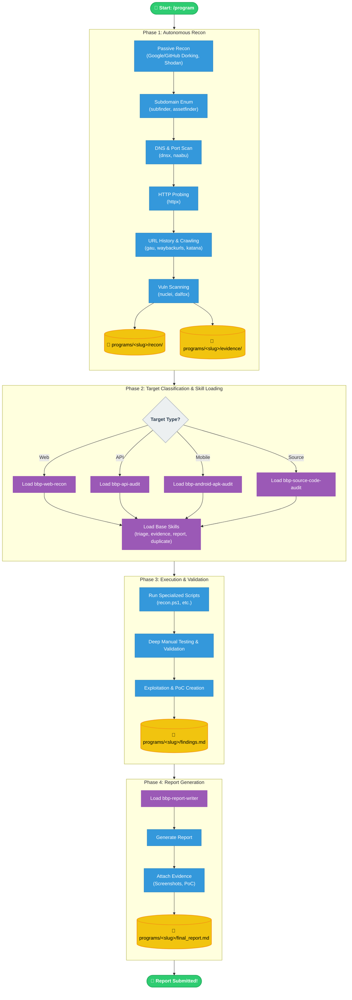

# BugBounty

Bug bounty workflow automation — agent-assisted recon, scanning, source audit, mobile analysis, and report writing.

## Prerequisites

Install these first:

| Tool | Minimum | Check |
|------|---------|-------|
| **Go** | 1.21+ | `go version` |
| **Python** | 3.11+ | `python --version` |
| **Node.js** | 18+ | `node -v` |
| **Rust** | 1.70+ | `rustc --version` |
| **Java JDK** | 17 | `java -version` |
| **Git** | any | `git --version` |

Windows only: install [Go](https://go.dev/dl/), [Python](https://www.python.org/downloads/), [Node](https://nodejs.org/), [Rust](https://rustup.rs/), [Java](https://adoptium.net/), [Git](https://git-scm.com/).

## Quick Setup

Clone and install:

```powershell
git clone <your-repo-url> C:\BugBounty
cd C:\BugBounty
scripts\update_all_tools.ps1
```

This installs:
- **Subdomain**: subfinder, amass, assetfinder
- **URL/Spider**: gau, waybackurls, katana, hakrawler
- **Probe**: httpx, dnsx
- **Fuzz**: ffuf
- **Scan**: nuclei
- **Secrets**: gitleaks, trufflehog
- **SCA**: trivy, grype, osv-scanner, cargo-audit
- **Code**: semgrep, codeql
- **Mobile**: apktool, jadx, frida, objection
- **Other**: jq, yq, fd, fzf, bat, delta

## Wordlists

```powershell
cd wordlists
git clone https://github.com/danielmiessler/SecLists
git clone https://github.com/swisskyrepo/PayloadsAllTheThings
```

## Agent Setup (opencode)

This repo is designed to work with [opencode](https://opencode.ai) CLI.

```powershell
# install opencode
npm install -g @anthropic-ai/claude-code
# or if using opencode:
npm install -g opencode-cli
```

Then open the repo:

```powershell
cd C:\BugBounty
opencode
# or: claude
```

The agent reads `AGENTS.md` and `SKILL.md` for full workflow instructions.

## Workflow

```
/program <program-url> [name]
```

This triggers:
1. Recon (subs → alive → URLs → nuclei)
2. Skill loading (web/API/mobile/source/cloud)
3. Deep testing based on findings
4. Report generation



## Structure

```
C:\BugBounty\
├── scripts\           # workflow automation scripts
├── .agents\skills\    # security audit skills & skill packs
├── _templates\        # report templates
├── programs\          # per-target workspace
│   └── <slug>\
│       ├── recon\     # raw recon output (gitignored)
│       ├── evidence\  # PoCs, screenshots (gitignored)
│       └── state.json
├── tools\             # binaries (gitignored, auto-installed)
├── wordlists\         # SecLists, PayloadsAllTheThings (gitignored)
├── recon\             # global recon (gitignored)
├── AGENTS.md          # agent workflow rules
├── SKILL.md           # command encyclopedia
└── README.md
```

## Private Programs

Login to your target platform (HackerOne, YesWeHack, Bugcrowd, etc.) in your browser, then:

```powershell
scripts\setup-cookies.ps1
```

Saves `cookies.txt` (gitignored). The agent auto-detects and uses it.
